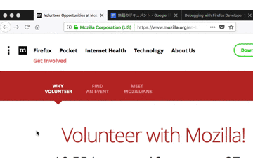

# Copy Link
====
A Firefox Add-on displays a context menu, and makes text link and html link on clipboard. 
## Description
- A Firefox WebExtension.
- Make the page link text and HTML link on your clipboard. 

## Demo

## Install
Open the .xpi with Firefox

## Usage

1. Open context menu.
1. When you click `Create link`, text link and HTML link will be copied to the clipboard.

## Licence

MIT License

## Author

[Naoki.H](https://www.keyton-co.jp/)